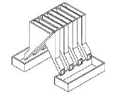

= Rice model
:docnumber: 17301
:tc-docnumber: 17301
:ref-docnumber: ISO 17301-1:2016(E)
:partnumber: 1
:edition: 2
:revdate: 2016-05-01
:copyright-year: 2016
:language: en
:title-intro-en: Cereals and pulses
:title-main-en: Specifications and test methods
:title-part-en: Rice (in English
:title-intro-fr: Céréales et légumineuses
:title-main-fr: Spécification et méthodes d'essai
:title-part-fr: Riz
:doctype: international-standard
:docstage: 30
:docsubstage: 92
:draft:
:technical-committee-number: 34
:technical-committee: Food products
:subcommittee-number: 4
:subcommittee: Cereals and pulses
:workgroup-number: 3
:workgroup: Rice Group
:mn-document-class: iso
:mn-output-extensions: xml
:local-cache-only:
:data-uri-image:

[[Foreword]]
.foreword
ISO (the International Organization for Standardization)
is a worldwide federation of national standards bodies (ISO member bodies). The work of preparing International Standards is normally carried out through ISO technical committees. Each member body interested in a subject for which a technical committee has been established has the right to be represented on that committee. International organizations, governmental and non-governmental, in liaison with ISO, also take part in the work. ISO collaborates closely with the International Electrotechnical Commission (IEC) on all matters of electrotechnical standardization.

The procedures used to develop this document and those intended for its further maintenance are described in the ISO/IEC Directives, Part 1. In particular the different approval criteria needed for the different types of ISO documents should be noted. This document was drafted in accordance with the editorial rules of the ISO/IEC Directives, Part 2 (see www.iso.org/directives).

Attention is drawn to the possibility that some of the elements of this document may be the subject of patent rights. ISO shall not be held responsible for identifying any or all such patent rights. Details of any patent rights identified during the development of the document will be in the Introduction and/or on the ISO list of patent declarations received (see www.iso.org/patents).

Any trade name used in this document is information given for the convenience of users and does not constitute an endorsement.

For an explanation on the voluntary nature of standards, the meaning of ISO specific terms and expressions related to conformity assessment, as well as information about ISO’s adherence to the World Trade Organization (WTO) principles in the Technical Barriers to Trade (TBT) see the following URL: www.iso.org/iso/foreword.html.

This document was prepared by Technical Committee ISO/TC {technical-committee-number}, {technical-committee}, Subcommittee SC {subcommittee-number}, {subcommittee}.

This second edition cancels and replaces the first edition (ISO {docnumber}-{partnumber}:2009), which has been technically revised.

The main changes compared to the previous edition are:

* updated normative references;
* deletion of 4.3.

A list of all parts in the ISO {docnumber} series can be found on the ISO website.

== Introduction

This document was developed in response to worldwide demand for minimum specifications for rice traded internationally, since most commercial bulks of grain, which have not been screened or aspirated, contain a proportion of other grains, weed seeds, chaff, straw, stones, sand, etc. The vegetable materials can have physical and biological properties which differ from those of the main constituent and can therefore affect the storage behaviour.

Rice is a permanent host to a considerable microflora; most of these microorganisms are cosmopolitan, the majority are innocuous, but some produce harmful by-products. Microflora communities present on freshly harvested rice include many types of bacteria, moulds and yeasts. While the rice is ripening and its moisture content is falling, the number of field microorganisms, mainly bacteria, diminishes. When the rice is harvested, it is invaded by storage microorganisms and the field microflora gradually dies out. If the mass fraction of moisture (formerly expressed as moisture content) is less than 18%, the microflora does not multiply, whereas above 18% it does so rapidly. Thus, at harvest, the qualitative and the quantitative composition of the microflora depends more upon ecological factors than upon the variety of the rice. During transport and storage, additions to the microfloral population occur. Microorganisms on the rice at harvest tend to die out during storage and are replaced by microorganisms adapted to storage conditions.

Storage losses have been estimated as being an average of 5%, and as much as 30%, especially in countries with climates favourable to the rapid development of agents of deterioration and where storage techniques are poorly developed, such as developing countries in the damp tropics. The magnitude of these figures highlights the need to promote throughout the world a rapid improvement in techniques of conservation.

=== Patent Notice

The International Organization for Standardization (ISO) draws attention to the fact that it is claimed that compliance with this document may involve the use of a patent concerning sample dividers given in <<AnnexA>> and shown in <<figureA-1>>.

ISO takes no position concerning the evidence, validity and scope of this patent right.

The holder of this patent right has assured ISO that he/she is willing to negotiate licences under reasonable and non-discriminatory terms and conditions with applicants throughout the world. In this respect, the statement of the holder of this patent right is registered with ISO. Information may be obtained from:

[align=left]
Vache Equipment +
Fictitious +
World +
gehf@vacheequipment.fic

Attention is drawn to the possibility that some of the elements of this document may be the subject of patent rights other than those identified above. ISO shall not be held responsible for identifying any or all such patent rights.

== Scope

This document specifies minimum requirements and test methods for rice (__Oryza sativa L.__).

It is applicable to husked rice, husked parboiled rice, milled rice and milled parboiled rice, suitable for human consumption, directly or after reconditioning.

It is not applicable to cooked rice products.

[bibliography]
== References

* [[[ISO712,ISO 712]]]__Cereals and cereal products – Determination of moisture content – Reference method__
* [[[ISO6646,ISO 6646]]],
__Rice – Determination of the potential milling yield from paddy and from husked rice__
* [[[ISO8351-1,ISO 8351-1:1994]]]__Packaging – Method of specification for sacks – Part 1: Paper sacks__
* [[[ISO8351-2,ISO 8351-2]]]__Packaging – Method of specification for sacks – Part 2: Sacks made from thermoplastic flexible film__
* [[[ISO16634,ISO 16634]]]__Cereals, pulses, milled cereal products, oilseeds and animal feeding stuffs – Determination of the total nitrogen content by combustion according to the Dumas principle and calculation of the crude protein content__
* [[[ISO20483,ISO 20483:2013]]]__Cereals and pulses – Determination of the nitrogen content and calculation of the crude protein content – Kjeldahl method__
* [[[ISO24333,ISO 24333:2009]]]__Cereals and cereal products – Sampling__

== Terms and Definitions

For the purposes of this document, the following terms and definitions apply.

ISO and IEC maintain terminological databases for use in standardization at the following addresses:

* ISO Online browsing platform: available at link:++http://www.iso.org/obp++[]
* IEC Electropedia: available at link:++http://www.electropedia.org++[]

[[paddy]]
=== paddy

alt:[paddy rice]
alt:[rough rice]

rice retaining its husk after threshing

[[husked_rice]]
=== husked rice

deprecated:[cargo rice]

__paddy__ (<<paddy>>) from which the husk only has been removed

[.source]
The term ”cargo rice” is shown as deprecated, and Note 1 to entry is not included here

=== milled rice

alt:[white rice]

__husked rice__ (<<husked_rice>>) from which almost all of the bran and embryo have been removed by milling

=== parboiled rice

rice whose starch has been fully gelatinized by soaking __paddy__ (<<paddy>>) rice or __husked rice__ (<<husked_rice>>) in water followed by a heat treatment and a drying process

=== waxy rice

variety of rice whose kernels have a white and opaque appearance

[NOTE]
====
The starch of waxy rice consists almost entirely of amylopectin. The kernels have a tendency to stick together after cooking.
====

=== extraneous matter

alt:[EM]
domain:[rice]

organic and inorganic components other than whole or broken kernels

[example]
====
Foreign seeds, husks, bran, sand, dust.
====

[[HDK]]
=== HDK

alt:[heat-damaged kernel]

kernel, whole or broken, which has changed its normal colour as a result of heating

[NOTE]
====
This category includes whole or broken kernels that are yellow due to alteration. Parboiled rice in a batch of non-parboiled rice is also included in this category.
====

=== damaged kernel

kernel, whole or broken, showing obvious deterioration due to moisture, pests, disease or other causes, but excluding __HDK__ (<<HDK>>)

=== immature kernel

alt:[unripe kernel]

kernel, whole or broken, which is unripe and/or underdeveloped

=== husked rice yield

amount of husked rice obtained from paddy

=== nitrogen content

quantity of nitrogen determined after application of the procedure described

[NOTE]
====
It is expressed as a mass fraction of dry product, as a percentage.
====

=== crude protein content

quantity of crude protein obtained from the nitrogen content as determined by applying the specified method, calculated by multiplying this content by an appropriate factor depending on the type of cereal or pulse

[NOTE]
====
It is expressed as a mass fraction of dry product, as a percentage.
====

[[gelatinization]]
=== gelatinization

hydration process conferring the jelly-like state typical of the coagulated colloids, which are named gels, on kernels

[NOTE]
====
See <<figureC-1>>.
====

[[gel_state]]
=== gel state

condition reached as a consequence of __gelatinization__ (<<gelatinization>>), when the kernel is fully transparent and absolutely free from whitish and opaque granules after being pressed between two glass sheets

=== gelatinization time

stem:[t_{9}0]

time necessary for 90% of the kernels to pass from their natural state to the __gel state__ (<<gel_state>>)

[[clause7]]
== Test report

For each test method, the test report shall specify the following:

. all information necessary for the complete identification of the sample;
. a reference to this document (i.e. ISO {docnumber}-{partnumber});
. the sampling method used;
. the test method used;
. the test result(s) obtained or, if the repeatability has been checked, the final quoted result obtained;
. all operating details not specified in this document, or regarded as optional, together with details of any incidents which may have influenced the test result(s);
. any unusual features (anomalies) observed during the test;
. the date of the test.

== Packaging

The packaging shall not transmit any odour or flavour to the product and shall not contain substances which may damage the product or constitute a health risk.

If bags are used, they shall comply with the requirements of
, or <<ISO8351-2>>, as appropriate.

[[AnnexA]]
[appendix]
== Determination of defects

=== Principle

Extraneous matter, broken kernels, damaged kernels and other kinds of rice are separated manually according to the following types: husked rice, milled rice, husked parboiled rice and milled parboiled rice. Each type is then weighed.

=== Apparatus

The usual laboratory apparatus and, in particular, the following.

[[AnnexA-2-1]]
[%inline-header]
==== Sample divider,

consisting of a conical sample divider or multiple-slot sample divider with a distribution system, e.g. ”Split-it-right” sample divider, such as that shown in <<figureA-1>>.

[%inline-header]
==== Sieve,

with round perforations of diameter 1,4 mm.

[%inline-header]
==== Tweezers.

[%inline-header]
==== Scalpel.

[[AnnexA-2-6]]
[%inline-header]
==== Paintbrush.

[%inline-header]
==== Steel bowls,

of diameter 100 mm stem:[\pm] 5 mm; seven per test sample.

[%inline-header]
==== Balance,

which can be read to the nearest 0,01 g.

=== Sampling

See <<clause5>>.

[[AnnexA-4-1]]
=== Procedure

==== Preparation of test sample

Carefully mix the laboratory sample to make it as uniform as possible, then proceed to reduce it, using a divider (<<AnnexA-2-1>>), until a quantity of about 30 g is obtained.

All parts of kernels which get stuck in the perforations of a sieve should be considered to be retained by the sieve.

[[figureA-1]]
.Split-it-right sample divider

=== Determination

Weigh, to the nearest 0,1 g, one of the test samples obtained in accordance with <<AnnexA-4-1>> and separate the different defects into the bowls (<<AnnexA-2-6>>). When a kernel has several defects, classify it in the defect category for which the maximum permissible value is the lowest (see <<table1>>).

Weigh, to the nearest 0,01 g, the fractions so obtained.

=== Calculation

Express the mass fraction of each defect using <<formulaA-1>>:

[[formulaA-1]]
[stem]
++++
w=(m_{D})/(m_{s})
++++

where

stem:[w]::
is the mass fraction of grains with a particular defect in the test sample;
stem:[m_{D}]::
is the mass, in grams, of grains with that defect;
stem:[m_{S}]::
is the mass, in grams, of the test sample.

=== Test report

Report the results as specified in <<clause7>>.

[bibliography]
== References

* [[[ISO3696,ISO 3696]]]__Water for analytical laboratory use – Specification and test methods__
* [[[ISO5725-1,ISO 5725-1]]]__Accuracy (trueness and precision) of measurement methods and results – Part 1: General principles and definitions__
* [[[ISO5725-2,ISO 5725-2]]]__Accuracy (trueness and precision) of measurement methods and results – Part 2: Basic method for the determination of repeatability and reproducibility of a standard measurement method__
* [[[ISO6322-1,ISO 6322-1]]]__Storage of cereals and pulses – Part 1: General recommendations for the keeping of cereals__
* [[[ISO6322-2,ISO 6322-2]]]__Storage of cereals and pulses – Part 2: Practical recommendations__
* [[[ISO6322-3,ISO 6322-3]]]__Storage of cereals and pulses – Part 3: Control of attack by pests__
* [[[ISO7301,ISO 7301:2011]]]__Rice – Specification__
* [[[ISO14864,ISO 14864:1998]]]__Rice – Evaluation of gelatinization time of kernels during cooking__
* [[[IEC61010-2,IEC 61010-2:1998]]]__Safety requirements for electric equipment for measurement, control, and laboratory use – Part 2: Particular requirements for laboratory equipment for the heating of material__
* [[[ref10,1]]][smallcap]#Standard No I.C.C 167#. __Determination of the protein content in cereal and cereal products for food and animal feeding stuffs according to the Dumas combustion method__ (see link:++http://www.icc.or.at++[])

* [[[ref11,2]]]
Nitrogen-ammonia-protein modified Kjeldahl method – Titanium oxide and copper sulfate catalyst. __Official Methods and Recommended Practices of the AOCS__ (ed. Firestone, D.E.), AOCS Official Method Ba Ai 4-91, 1997, AOCS Press, Champaign, IL

* [[[ref12,3]]][smallcap]#Berner D.L., & Brown J.# Protein nitrogen combustion method collaborative study I. Comparison with Smalley total Kjeldahl nitrogen and combustion results. __J. Am. Oil Chem. Soc.__ 1994, **71** (11) pp 1291-1293

* [[[ref13,4]]][smallcap]#Buckee G.K.# Determination of total nitrogen in barley, malt and beer by Kjeldahl procedures and the Dumas combustion method – Collaborative trial. __J. Inst. Brew.__ 1994, **100** (2) pp 57-64

* [[[ref14,5]]][smallcap]#Frister H.#__Direct determination of nitrogen content by Dumas analysis; Interlaboratory study on precision characteristics__. AOAC International, Europe Section 4th International Symposium, Nyon, Switzerland, 1994, 33 pp

* [[[ref15,6]]][smallcap]#Ranghino F.# Evaluation of rice resistance to cooking, based on the gelatinization time of kernels. __Il Riso__. 1966, **XV** pp 117-127

* [[[ref16,7]]][smallcap]#Tkachuk R.# Nitrogen-to-protein conversion factors for cereals and oilseed meals. __Cereal Chem.__ 1969, **46** (4) pp 419-423

